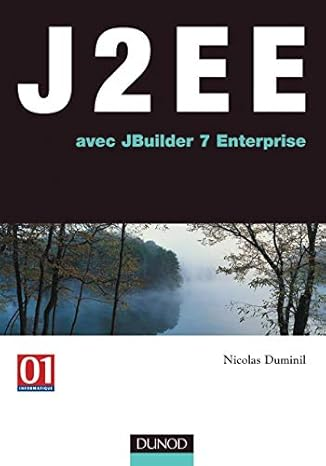
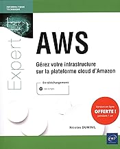
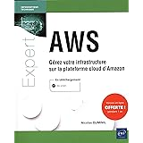
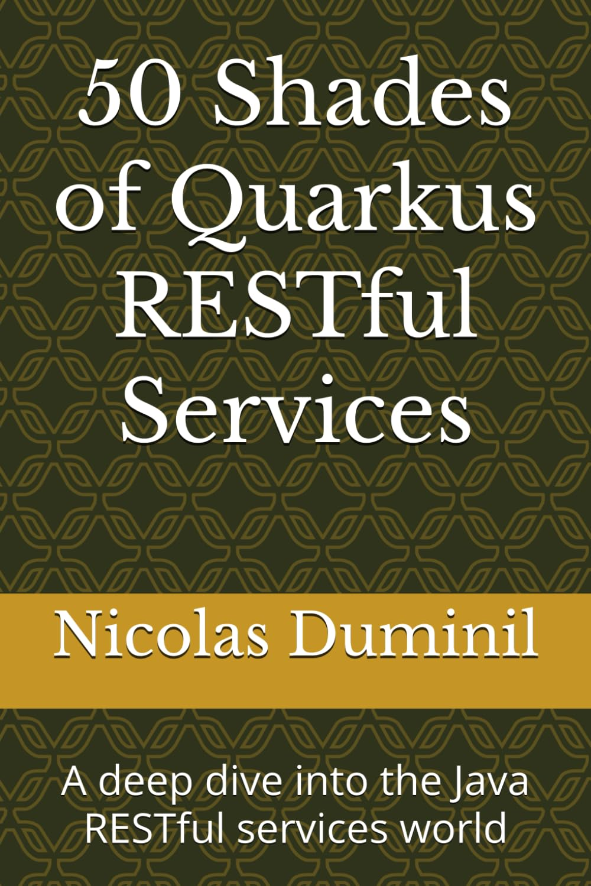

## [J2EE avec JBuilder 7 enterprise](https://shorturl.at/TOyy8)

Published in French, this is my first book on Java Enterprise, currently named Jakarta EE, formerly Java EE and, even more formerly J2EE.

## [AWS : Gérez votre infrastructure sur la plateforme cloud d'Amazon](https://shorturl.at/U9qGW)

Published in French as well, this book takes the reader to a long journey to the the AWS platform and to its configuration, administration and deployment.

## [AWS Lambda: Developpez des micro-services en Java](https://shorturl.at/PDGMa)

This is a complete guide to the Serverless technology as implemented by AWS Lambda. It demonstrates how to develop and deploy enterprise grade micro-services using Quarkus.

## [50 Shades of Java Executors](https://shorturl.at/ZekHg)

My most recent booklet on concurrent programming techniques in Java, with a particular focus on race condition management through multi-threading and executors. t explores modern concurrency patterns and implementations, highlighting the latest features introduced in Java 21 and 23 LTS (*Long Term Support*) releases. Special attention is given to the evolution of Java's executor framework and its role in managing concurrent operations efficiently.

## [50 Shades of Java Executors - Kindle edition](https://shorturl.at/wEqNz)

This is the Kindle edition of my most recent booklet on concurrent programming techniques in Java, with a particular focus on race condition management through multi-threading and executors. t explores modern concurrency patterns and implementations, highlighting the latest features introduced in Java 21 and 23 LTS (*Long Term Support*) releases. Special attention is given to the evolution of Java's executor framework and its role in managing concurrent operations efficiently.

## [50 Shades of Quarkus RESTful Services](https://shorturl.at/pwCfN)

My most recent on Quarkus and RESTful services is available in paperback, hardcover and Kindle format. This booklet is dedicated to software architects and developers who think that the allegedly "no-code" solutions are rubbish and the ML and LLM based tools, while unavoidable nowadays, aren't meant to generate end-to-end code.

What's inside:

  - Historical approach of the RESTful services, from the RPC/Corba/DCOM ancestors, up to date.
  - Quarkus RESTful services basics and annotations.
  - Eclipse MicroProfile implementation by Quarkus.
  - Quarkus Synchronous RESTful services and clients.
  - Quarkus Asynchronous RESTful services and clients.
  - Quarkus Reactive RESTful services and clients.
  - Anatomy of enterprise grade applications.
  - Quarkus microservices based implemntation.
  - Quarkus unit, integration and end-to-end testing.

You don't need to be a Java champion to read this booklet, just be willing to become one. Ready ?

